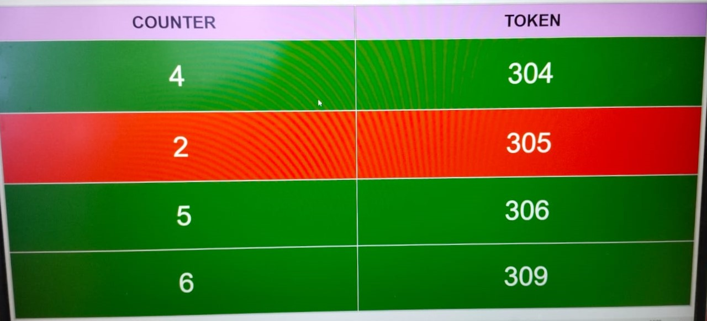
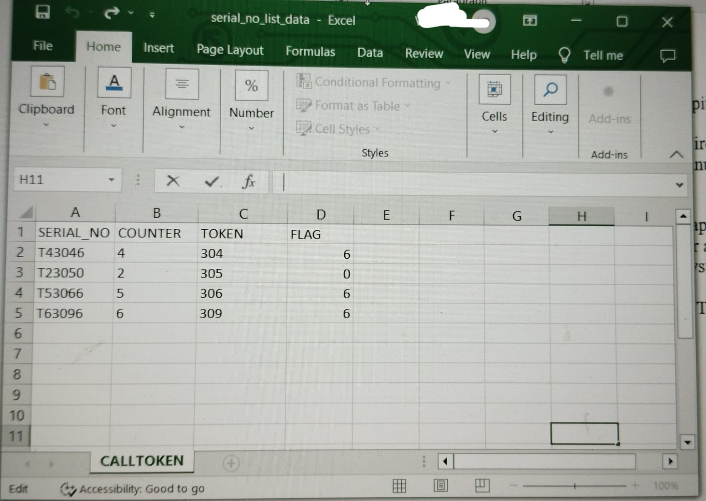
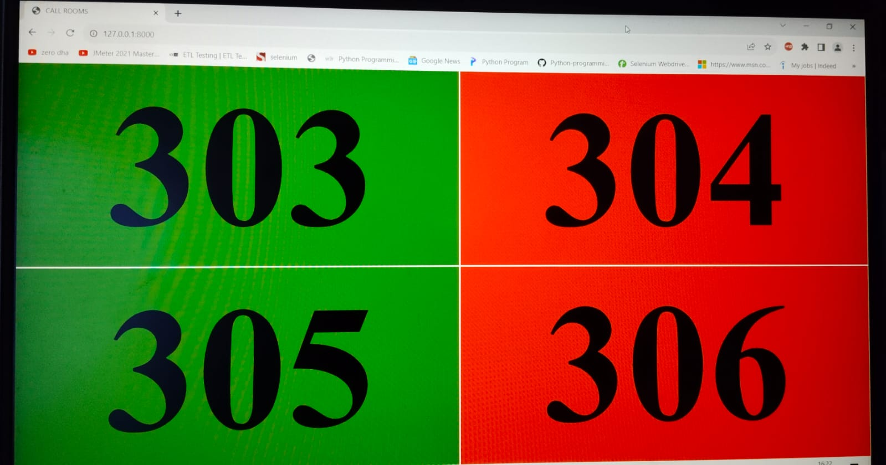
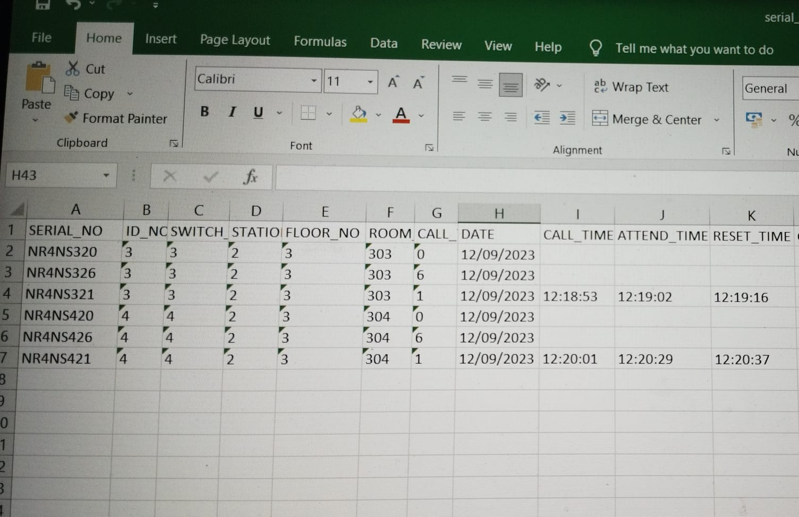

Project 1 : Token Management System in Hospital with Wireless Token System
Technologies: Python, Django, HTML, CSS, JS
Project Description:
Token Management System is a web application built using Django Server (Rasbperry Pi) 
to view all the Patients Counter and Token Management in Hospital with Connection of devices like Wireless Token System.

Steps:
1. Get the Serial Number from USB Serial port and update the serial number and its data in Excel sheet.
2. From the serail number extract or split the values to get Counter, Token ,Flag.
3. Read the excel and get the counter,Token and return the values of Counter,Token to the webpage with indicates Counter available/not available based on flag values(red/green)

Project 2 : Room Management System with Wireless CallBell System (AUG 2023- SEP 2023)
Technologies: Python, Django, HTML, CSS, JS
Project Description:
Room Management System is a web application built using Django Server to view all the Patients Room Management for Call devices (Wireless Call Bell System)

Steps:
1. Get the Serial Number from USB Serial port and update the serial number and its data like switch id, station id,date,call attended,room no,etc in Excel sheet.
2. From the serail number extract or split the values to get room no, call time, call attended, call reset.
3. Read the excel and get the room no and flag return the values of room no, flag to the webpage with indicates rooms available/not available based on flag values(red/green)

